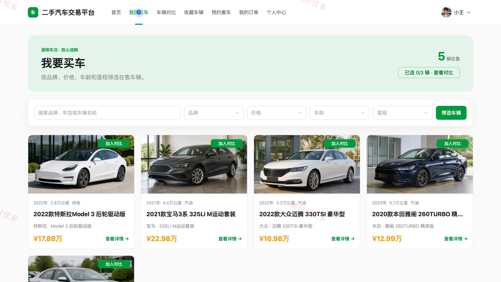
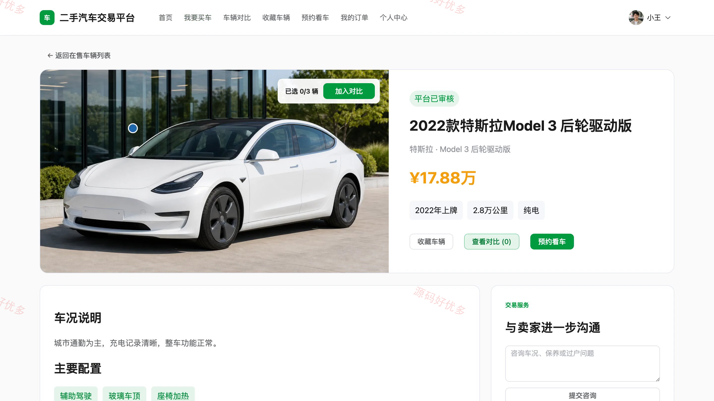
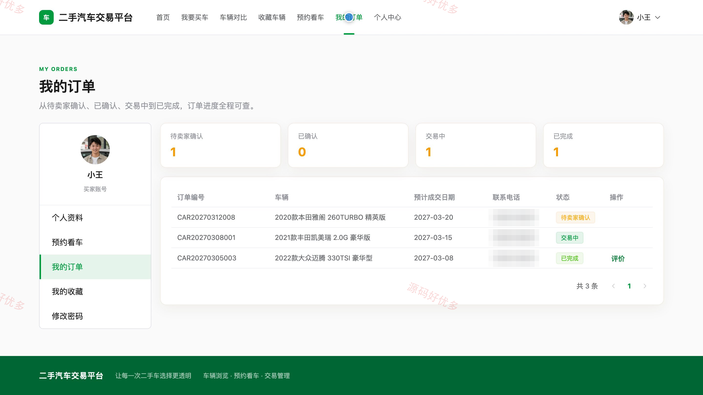
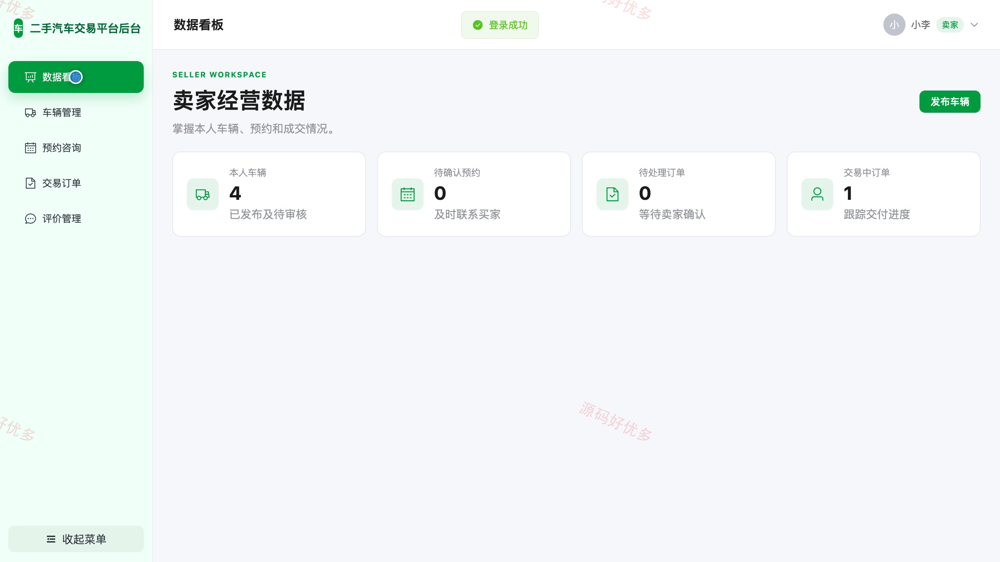
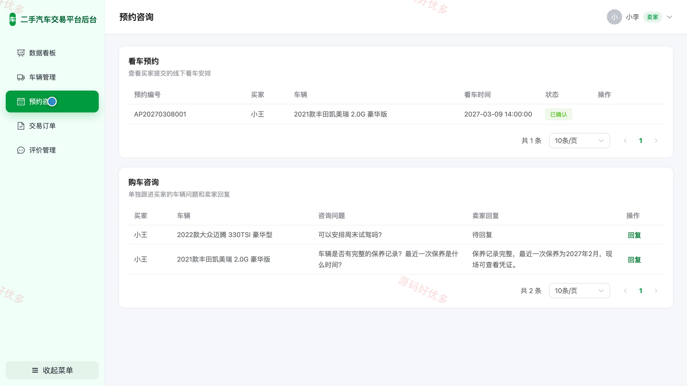
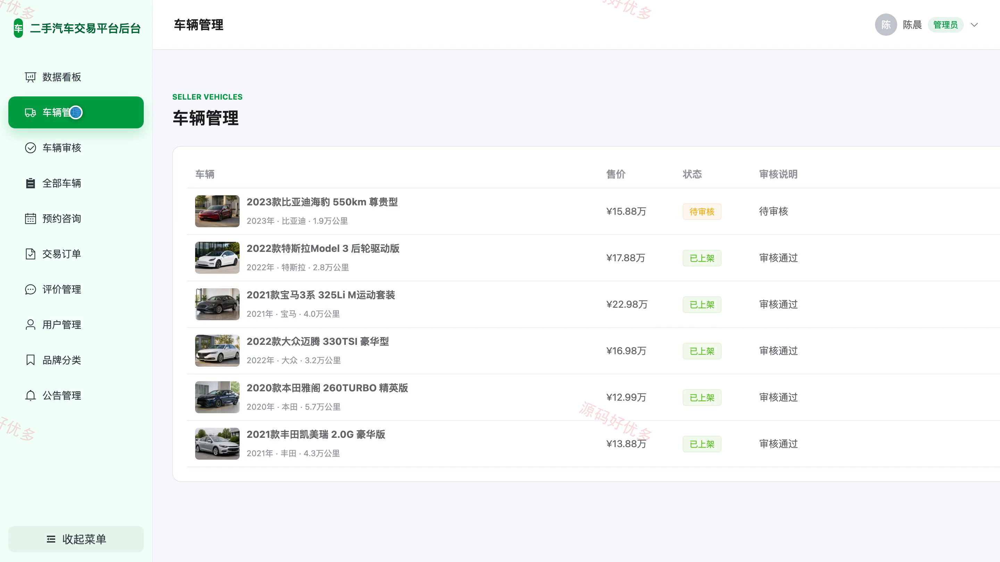
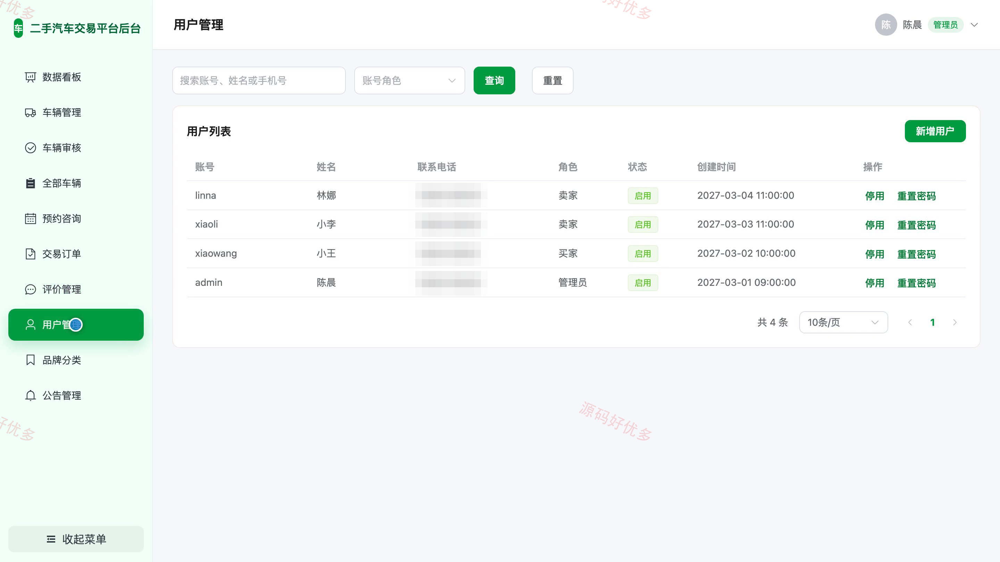

## 源码问题查看主页咨询

### 一、关键词
二手汽车交易、二手车买卖、旧车交易、汽车转让、车辆交易平台

### 二、作品包含
源码+数据库+万字设计文档+PPT+全套环境和工具资源+本地部署教程

### 三、项目技术
前端技术： Html、Css、Js、Vue3.4、Element-Plus
后端技术：Java、SpringBoot3.2.0、MyBatis-Plus

### 四、运行环境（以下版本亲测，其他版本兼容性请自行测试）
开发工具：IDEA/eclipse + VSCODE

数据库：MySQL5.7+（共11张表）

数据库管理工具：Navicat10以上版本

环境配置软件： JDK17 + Maven

前端Nodejs：16+

浏览器：谷歌浏览器

### 五、项目介绍
项目编号：bs094A

该系统面向二手汽车交易场景，为买家提供车辆筛选、详情对比、收藏咨询、预约看车、订单跟踪与交易评价；为卖家提供车辆发布、预约咨询处理、订单处理与经营统计；管理员负责用户、车辆审核、交易记录、公告和基础分类维护。

角色：买家、卖家、管理员

买家功能：注册登录与资料维护、车辆浏览与筛选、车辆详情与对比、收藏与购车咨询、预约看车、交易订单跟踪、交易评价。

卖家功能：注册登录与资料维护、车辆发布与上下架管理、咨询回复与预约处理、购车订单处理、交易评价查看、经营数据统计。

管理员功能：用户与品牌分类管理、车辆审核与管理、交易订单管理、预约与咨询管理、交易评价管理、平台公告管理、平台业务数据统计。

### 六、运行截图

